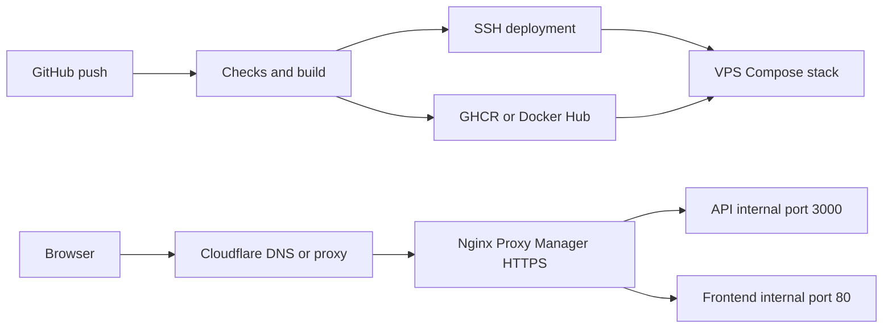

# Deployment runbook

Status: template. Replace placeholders with verified facts; include no credentials.

## Architecture



## Service inventory

| Service | Network alias | Internal port | External endpoint |
|---|---|---|---|
| api | lesson-api | 3000 | https://api.YOUR_DOMAIN |
| frontend | lesson-frontend | 80 | https://app.YOUR_DOMAIN |
| nginx-proxy-manager | nginx-proxy-manager | 80, 443, 81 | HTTPS; admin through SSH tunnel |

Add real database/monitoring services only if deployed. Get container IDs using `docker compose ps`; do not assume container names.

## Normal deployment

Push main → quality gate → publish → verify digest → SSH → locked pull/update → health checks → record successful release. Repository: REPLACE. Workflow: REPLACE. Observed duration: NOT MEASURED. Public verification URL: REPLACE.

## Manual deployment and rollback

```bash
cd /home/deploy/app
bash ./deploy.sh 'REGISTRY/OWNER/IMAGE@sha256:REAL_DIGEST' --proxy
curl --fail https://api.YOUR_DOMAIN/health
```

For rollback, take the preceding successful digest from `.previous-release.env` or your release history and run the same command. Keep registry artifacts available. Verify the response and running reference. Database recovery/migrations require a separate tested plan.

## Inspect the application

```bash
cd /home/deploy/app
docker compose --env-file .env --env-file .release.env -f compose.yaml -f compose.prod.yaml -f compose.proxy.yaml ps
docker compose --env-file .env --env-file .release.env -f compose.yaml -f compose.prod.yaml -f compose.proxy.yaml logs --tail=50 api
```

## Debug ladder

1. DNS: `dig api.YOUR_DOMAIN @8.8.8.8 +short`; check AAAA too.
2. Connectivity: `nc -zv YOUR_VPS_IP 443`.
3. TLS and HTTP: `curl --fail --show-error https://api.YOUR_DOMAIN/health`.
4. NPM: check container state, upstream alias, internal port, proxy network and certificate.
5. Application: inspect health, recent logs and effective configuration without printing secrets.
6. Artifact: compare running reference with the expected release digest.
7. Automation: read the failed step and correlate its time with server logs.

## VPS access

`ssh -p YOUR_SSH_PORT deploy@YOUR_VPS_IP`

Credentials live in the approved secrets store, not here. Record the trusted host-key fingerprint location and emergency provider console procedure.

## Common issues

| Symptom | Likely cause | Fix |
|---|---|---|
| SSH denied | Key/user/port mismatch | Verify authorized key and server configuration |
| Pull denied | Private registry access | Restore scoped server read credentials |
| 502 | Upstream not reachable | Check shared network and healthy service |
| Unhealthy container | App/config error | Inspect logs; restore known-good release |
| HTTPS fails | DNS or certificate/proxy issue | Check A/AAAA, TLS mode and certificate |

## Evidence and maintenance

Record last successful digest, public health result, verification time, operator, rollback test, backups and restore test, certificate renewal, alert owner and recovery procedure. A checklist is complete only after its action succeeds.
